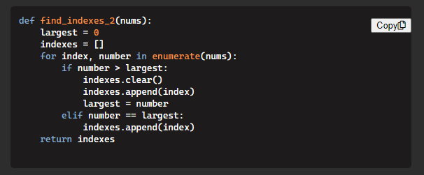

# CopyCatCoder

## Description

This is my first extension. Looking to get my feet wet with browser extensions. This extension adds a copy code button to code-blocks found on stackoverflows website


-----------------------
## Technologies
* Javascript
* Git/Github

-----------------------
## Contributing
Clone repo.  
In Chrome, go to ```chrome://extensions```  
Enable Developer Mode  
Click ```Load unpacked```  button and select extension directory.
You must reload the extension, by clicking the reload button, aafter any changes made to the extension.

-----------------------
## Licenses
This project uses a [MIT License](https://opensource.org/licenses/MIT). 

-----------------------
## Contact
If you have any questions you can reach me at the following email: [akhalid.code@gmail.com](mailto:akhalid.code@gmail.com)

Follow my other work at GitHub: https://github.com/akhalid88/